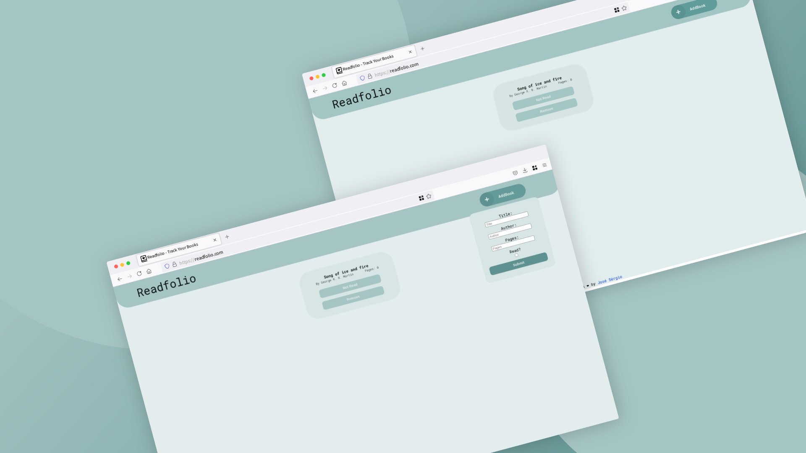

# PROJECT-Library

## Description

This project is a library app that allows the user to add books to a library and mark them as read or not read. The app will also allow the user to remove books from the library. It was built using JavaScript, HTML, and CSS.

The project is part of the This project is part of the [The odin project](https://www.theodinproject.com/lessons/node-path-javascript-library) curriculum, which is a free open source full stack web development course.

## Preview

## Live Demo

[Live Demo Link](https://mrescappe.github.io/PROJECT-Sign-up/)

## Features

- The user can add books to the library.
- The user can mark books as read or not read.
- The user can remove books from the library.

## Built with

- 
- 
- 

## What I learned

- I learned more about HTML forms and how to use them.
- I learned more about DOM manipulation using JavaScript.
- I learned more about css grid and how to use it.
